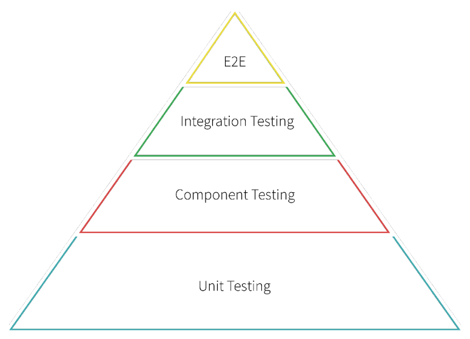

# Lecture 9 - GitHub, Travis CI (Guest lectures)

## GitHub by John Britton
GitHub Classroom is an tool for creating programming exercises or problem sets and distributing them to students enrolled in a course. This will be used as an example porject to showcase a workflow for developing web applications.

1. The first step is to fork the main classroom repository and clone it onto a computer.
2. When making improvements and changes to this repository, a good paradigm to follow is the feature-branch development strategy, in which a new branch is made for each feature, bug report, etc., which is merged back into the master branch as soon as it’s done and ready to be released. This is one example of a **continuous deployment** strategy.
    - A completely different development strategy is **released-based development**, which is more common in desktop applications or applications that are shipped out. In these applications, developers will build up, for example, the version 1.0 branch, while also working on a 1.1 branch, even though the latter will only be released 6 months later, perhaps.
3. Once a feature has been developed in a separate branch, those changes should be pushed to the personal, forked version of the repository. Then, a pull request should be opened on the main repository. This repository is then sent to Travis as a build to be tested. Any co-developers can also review the pull request, provide feedback, and discuss the changes.
4. Once the pull request is reviewed and accepted, the next step is to actually deploy the new version of the application. Ideally, deployment should be continual. The more time spent building up a separate branch without integration and deploying it, the harder it will be to integrate and deploy it successfully in the future.

One way to progressively deploy a large feature is with feature toggles. A feature toggle consists of a break in the code where one of two versions can be chosen based on certain variables. This can be used to deploy new features without impacting all users at once. This could be used, for example, to let a small group of beta testers try out the new feature. This feature can now be continually deployed and developed, and when the time comes, it can be deployed to an increasing number of users. Ultimately, the feature toggle can be removed as the feature becomes fully deployed.

## Travis CI by Anna Nagy
To review, continuous integration is a development strategy that revolves around continually adding code to a codebase. CI can also refer to a tool that helps facilitate this process. Travis is one such tool.

A large part of CI is testing (**test-driven development**). Tests can be either *manual* or *automatic*, *functional* or *non-functional*. 

- **Manual tests** involve simply checking features by hand.
- A more preferred approach is to write **automated tests**, which are scripts a machine can run to verify an assertion.

- **Functional tests** check a specific functionality of an application and ensures that it meets all the expected requirements.
- **Non-Functional tests** check for performance, usability, reliability, etc. It is designed to test the readiness of a system as per nonfunctional parameters which are never addressed by functional testing.

From bottom to top, the different levels of testing can be thought of as:

1. **Unit testing** - testing individual software component or module. Typically done by the programmer and not by testers, as it requires detailed knowledge of the internal program design and code.
2. **Component testing** (check whole packages) - testing of multiple functionalities as a single code and its objective is to identify if any defect exists after connecting those multiple functionalities with each other.
3. **Integration testing** (check that packages work together) - testing of all integrated modules to verify the combined functionality after integration.
4. **End-to-End testing** (check the entire flow) - testing of a complete application environment in a situation that mimics real-world use, such as interacting with a database, using network communications, or interacting with other hardware, applications, or systems if appropriate.

Tests should ensure that things both work and fail as they should. Testing should happen as development progresses, not at the end.

Another part of the CI workflow is **the build**. A build is any complete, tested version of an application (it may have failed or passed those tests), but build can also be verb that describes the testing process.

CI systems, as opposed to simply testing on a single machine, help to ensure reproducability and facilitate collaboration. They lead to tidy deploys that have already been tested in an environment as close to the production environment as possible and a faster development flow due to improved confidence in code and pull requests. CI systems allow for automation for many parts of the development process.

CD is a natural result of CI. Because every commit is tested, every commit is deployable.